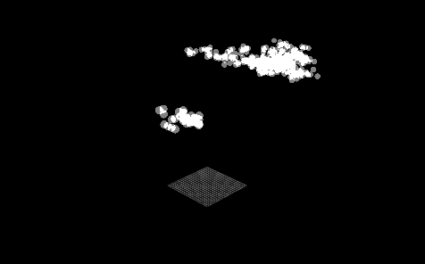
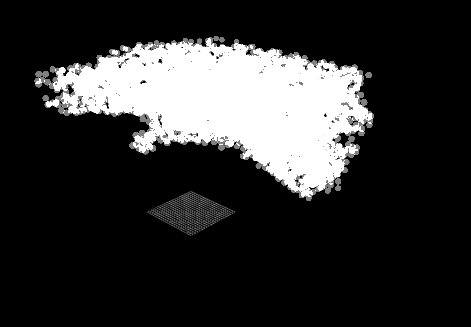

# Physical Simulation of Cloud Formation. 

Independent Study in Bucknell Computer Science Department. Under Dr. Joshua Stough

## Project Description

Physically based cloud simulation. Methods and algorithms are based off of Master Thesis of DEREK ROBERT OVERBY.





### Prerequisites

What things you need to install the software and how to install them

```
Give examples
```

### Installing

A step by step series of examples that tell you have to get a development env running

Say what the step will be

```
Give the example
```

And repeat

```
until finished
```

End with an example of getting some data out of the system or using it for a little demo

## Results 

We will insert a written description of our results along with a few key graphs. 


## Built With

* [Python](https://www.python.org/) - Used as main coding platform

## Authors

* Rafael Orozco

## Acknowledgments

* Joshua Stough
* Christina Hamlet 

