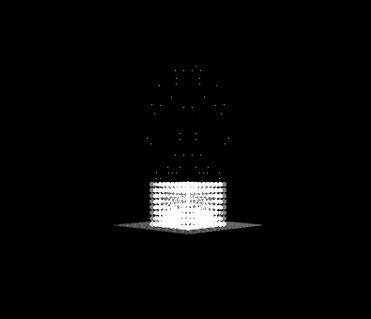

# Physical Simulation of Cloud Formation. 

Independent Study in Bucknell Computer Science Department. Under Dr. Joshua Stough

## Project Description

Physically based cloud simulation. Methods and algorithms are based off of Master Thesis of DEREK ROBERT OVERBY.

## Results 

We succesfully implemented the Overby method and were able to run a simulation that resulted in a physically based cloud formation.

## Built With

* [Python](https://www.python.org/) - Used as main coding platform
* [PyQtGraph](http://www.pyqtgraph.org/) - 3d visualizer
* [Noise](https://github.com/caseman/noise) - Perlin noise generator

## Authors

* Rafael Orozco

## Acknowledgments

* Prof. Joshua Stough
* Prof. Christina Hamlet 

